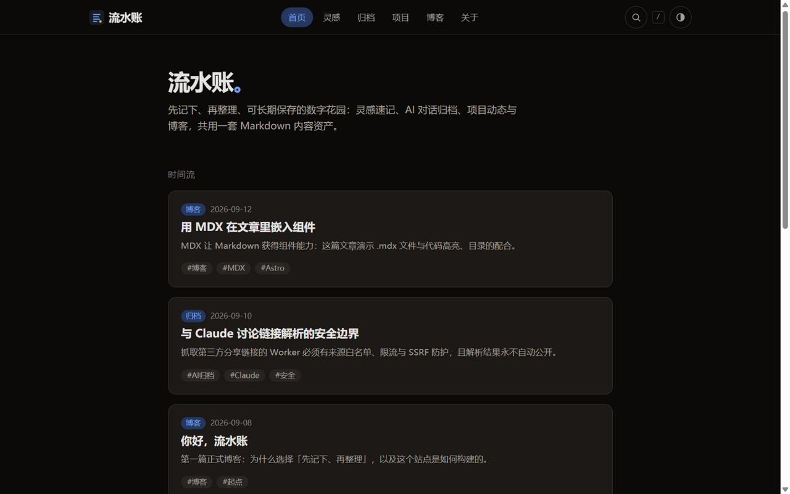
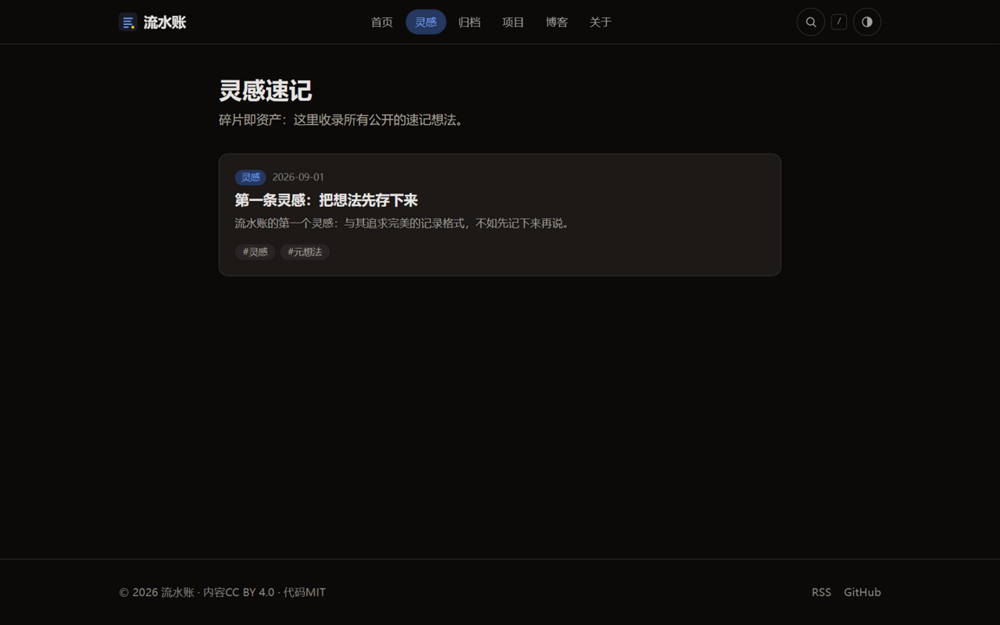
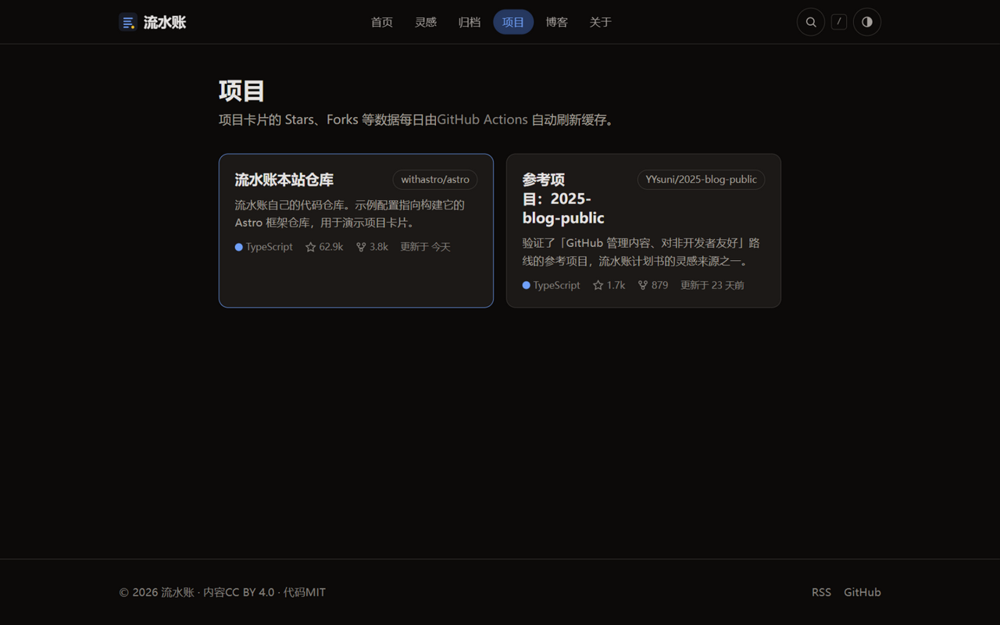

# 流水账（Flow Ledger）

一个「先记下、再整理、可长期保存」的个人数字花园：灵感速记、AI 对话归档、GitHub 项目动态与正式博客共用一套 Markdown 内容资产，构建为静态站点发布到 GitHub Pages。

- **线上地址**：<https://os233.github.io/flow-ledger/>
- **内容源**：本仓库 `content/` 目录下的 Markdown/MDX 文件——Git 即内容源，内容与站点永不分家
- **当前状态**：P0（可发布基础站）、P1（写作导入导出）、P2 首批（手工归档流）已完成并通过验收

## 站点预览



| 灵感速记 | 项目卡片 |
| --- | --- |
|  |  |

## 功能特性

以下均为**已实现并通过验收**的能力：

- **五类内容资产**：`notes`（灵感速记）、`archives`（AI 对话归档）、`projects`（GitHub 项目）、`posts`（正式博客）与 `pages`（关于等独立页面），全部以 Markdown/MDX 书写，Frontmatter 由 Astro Content Collections + Zod 在构建期校验。
- **可见性分级**：`status: public / draft / private` 三态。`private` 条目在构建期被完全过滤——不生成页面、不进列表、RSS 或 sitemap；`draft` 在生产构建不可见，本地开发可预览。
- **全文搜索**：Pagefind 构建期建立索引，无需任何服务端。
- **订阅与发现**：RSS 订阅源与 sitemap 自动生成；Shiki 代码高亮。
- **GitHub 项目卡片**：Stars/Forks 等数据读取构建期缓存，站点构建不依赖网络；缓存每日由 GitHub Actions 定时刷新。
- **写作导入导出（P1）**：从 HTML/Markdown 导入内容、按 slug 或全站导出 ZIP、脚手架新建内容。
- **AI 对话手工归档（P2 首批）**：将对话分享内容整理为符合 schema 的归档条目。
- **阅读体验**：View Transitions 页面切换过渡、响应式布局、浅色/深色主题跟随系统。

技术栈：Astro 7 + TypeScript + Tailwind CSS 4，静态输出，部署于 GitHub Pages（子路径 `/flow-ledger/`）。

> P2 其余能力（Worker 在线解析、平台适配器、LLM 增强）与 P3（主题市场）仍为**规划中**，尚未实现。

## 内容结构

```
content/
  notes/        # 灵感速记：短内容，可标记为私密、草稿或公开
  archives/     # AI 分享内容的原链接、解析结果、来源与归档日期
  projects/     # 手工说明 + GitHub 仓库标识
  posts/        # 正式博客（Markdown/MDX）
  pages/        # 关于、订阅、使用说明
public/media/   # 图片与附件
```

统一元数据（Frontmatter）：`title`、`date`、`updated`、`tags`、`status`、`summary` 等，字段规范与各类型示例见 [docs/content-guide.md](docs/content-guide.md)。

> 标为 `status: private` 的内容在构建期被过滤，不会进入线上产物。**但构建期过滤不是访问控制**：公开仓库及其 Git 历史对任何人都可读，敏感内容不得提交到公开仓库，详见 [docs/content-guide.md](docs/content-guide.md) 的「隐私红线」。

## 快速开始

环境要求：Node.js 24 LTS（CI 与部署同样使用 Node 24；Node 22 须 ≥ 22.12——`npm run export` 经 require(esm) 加载 archiver 8，仅使用仍受上游支持的 LTS 版本）。

```bash
npm install   # 安装依赖
npm run dev   # 启动开发服务器 http://127.0.0.1:4321/flow-ledger/
```

> **PowerShell 用户**：首次运行 `npm` 若报「无法加载文件 npm.ps1，因为在此系统上禁止运行脚本」，执行一次
> `Set-ExecutionPolicy -ExecutionPolicy RemoteSigned -Scope CurrentUser` 即可（仅当前用户，无需管理员）；或改用 `npm.cmd run ...` / Git Bash。
>
> **访问地址**：开发/预览服务器显式绑定 `127.0.0.1`——部分环境下 `localhost` 会被解析为 IPv6 且浏览器不回退，导致连接被拒，请直接使用 `127.0.0.1` 地址。

## 常用命令

| 命令 | 作用 |
| --- | --- |
| `npm run dev` | 启动开发服务器 |
| `npm run check` | Astro 同步与类型检查 |
| `npm run build` | 类型检查 + 构建静态站点到 `dist/`（含 Pagefind 搜索索引） |
| `npm run preview` | 本地预览构建产物 |
| `npm run check:links` | 构建产物内部链接检查（需先 `build`） |
| `npm run check:visibility` | private/draft 不进产物的回归检查（需先 `build`） |
| `npm run new` | 新建内容（脚手架，默认 `status: draft`） |
| `npm run archive` | AI 对话手工归档（P2 首批） |
| `npm run import` | 导入 HTML/Markdown 为内容文件（P1） |
| `npm run export` | 导出单篇或全站 ZIP（P1） |
| `npm run fetch:github` | 刷新 GitHub 项目卡片缓存（可选，无需 token，匿名限额每小时 60 次） |

内容工作流示例：

```bash
npm run new -- posts "我的新文章" --slug my-post --tags a,b    # 新建内容（默认草稿）
npm run archive -- 对话.md --source-url <分享链接>              # 归档 AI 对话
npm run import -- <文件或目录> --type posts                     # 导入内容
npm run export -- <slug>                                       # 导出单篇
npm run export -- --all --with-drafts                          # 导出全站（含草稿）
```

## 部署（GitHub Pages）

1. 在 GitHub 创建公开仓库 `flow-ledger`，将本目录推送上去（`main` 分支）。
2. 仓库 **Settings → Pages → Build and deployment → Source** 选择 **GitHub Actions**。
3. 之后每次推送或合并到 `main`，会自动执行类型检查、构建、链接检查并发布。

相关工作流：

| 工作流 | 触发 | 作用 |
| --- | --- | --- |
| CI | PR | 类型检查、构建、内部链接与内容可见性检查 |
| Deploy | push main | 构建并部署到 GitHub Pages |
| PR Preview | PR 打开/更新/关闭 | 预览部署到 `preview/pr-<编号>/` 子路径并评论链接；关闭时自动清理 |
| Refresh GitHub data | 每日定时 | 刷新项目卡片的 Stars/Forks 等缓存数据 |

## 备份与恢复

Git 远端**不是**私密内容的安全边界，也不等同于独立备份（计划书第 9 节）：

- **备份对象**：仓库本身 + `content/`（内容源）+ `src/data/github-cache.json`（可重建，非关键）；
- **恢复步骤**（从克隆重建站点，已演练验证）：

  ```bash
  git clone <仓库地址> flow-ledger-restore
  cd flow-ledger-restore
  npm ci
  npm run build          # 产出 dist/，含类型检查、链接与可见性检查
  npm run preview        # 验证站点可正常渲染
  ```

- **恢复点目标**：每次 push 到远端即为一个恢复点；本地未提交内容不在任何恢复点内，重要草稿请尽早提交；
- 私密内容不走公开仓库备份，按「隐私红线」使用私有仓库或加密备份。

## 项目文档

| 文档 | 内容 |
| --- | --- |
| [programs.md](programs.md) | 项目总览与阶段规划 |
| [docs/architecture.md](docs/architecture.md) | 架构设计、技术选型与关键决策 |
| [docs/content-guide.md](docs/content-guide.md) | 内容字段规范、写作指南与隐私红线 |
| [docs/p0-acceptance.md](docs/p0-acceptance.md) / [p1-acceptance.md](docs/p1-acceptance.md) / [p2-acceptance.md](docs/p2-acceptance.md) | 各阶段验收记录 |
| [AGENTS.md](AGENTS.md) | AI 协作开发约定 |

完整的《流水账开发计划书》保存在仓库外，不在本仓库分发。

## 许可证

- 代码：[MIT](LICENSE)
- 内容（`content/`）：CC BY 4.0（转载内容保留原作者署名）
